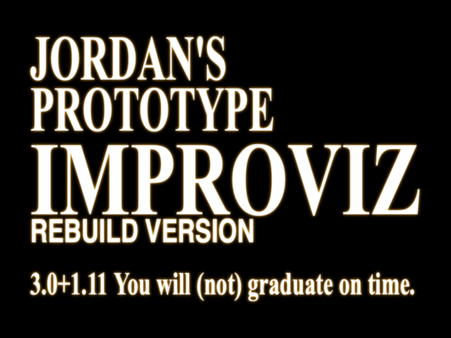

# Project_May4th
repository for Piano 2.0 MVP v1

### reBuild requirements as of 11.04.2023

#### design elements
Controllers 
 * RollScript - responsible for spawning and rolling piano roll
 * TimeMgr - for time control, timebar generation, tempo management, time signature etc
 * ImprovMgr - manages all highlighted keys that produces viz 
 * InputMgr - manages scoring, timing in relation to user press and chord information
 * VizMgr - contains all toggle-able checkboxes that produces "adaptive" dynamic options for the user

Models
 * ChordMgr - contains all chord-key piano information 
 * CollectionMgr - contains all chord-improv-pairing information. 
 
Views are integrated into the design of the classes. In principle we can see Builder, Factory, Wrapper and Iterator elements among our design. 

More information about dependencies and relationships will be revealed soon as we finalise the design. 

#### new targets 
- [x] create classes
- [x] integrate them with the piano canvas environment
- [x] migrate existing functions from now-decommissioned RollScript.cs
- [x] implement TimeMgr 
- [x] implement ImprovMgr
- [x] implement ChordMgr
- [x] implement InputMgr
- [x] cleanup RollScript to its new intended purpose
- [ ] find a way to implement MapLines() - discussed with bosses. 
- [x] rework RollScript.cs specifically SpawnKeys(), RollKeys() and ~~MapLines()~~ functions
- [x] implement CollectionMgr
- [x] implement passing of information based on targetted dependencies
- [ ] implement VizMgr and toggle 
- [ ] demo to bosses
- [ ] Study 1 with Improv Teachers
- [ ] Study 2 with Improv Students
- [ ] Study 3 on Spatiotemporal Data collection
- [ ] Graduate
 
### MVP version ready by ~22 Aug~ ~I DONT EVEN KNOW ANYMORE~ AY WE HERE BRUH 

### v1 requirements

#### hardware details ===

- MIDI prototype model: Kurzweil K2000 v3 [reference](https://kurzweil.com/k2000/#faqs), [manual](https://kurzweil.com/wp-content/uploads/2019/10/Setup_Mode.pdf).

#### software details ===

#### latest updates as of ~~12/07/2022~~ 07.02.2023

target completion of MVP 12/08/2022  ~~13/11/2021~~

~~#### latest updates as of 16/11/2021~~

~~target completion of MVP 13/11/2021 30/11/2021~~

#### targets for an minimum viable product (MVP) - ALL DONE

##### hardware targets
- [x] setup MIDI input with laptop
- [x] see how input data looks like
- [ ] ~~\(Optional) set output in a target file destination~~
- [x] allow user to press key
- [x] ~~play sound via garageband~~
- [x] identify which key is pressed (return keybinding) 
- [x] projector setup
- [x] laser cutting of projection board
- [x] applying white paint/tape on black keys to assist projection visuals
- [x] applying subtle key labels for new users
- [x] solve issues with keys C6 to G6 having a delayed startup (significant delay)
- [x] setup back stand of white screen for stability 

##### software targets 
- [x] setup unity environment for the piano roll engine
- [x] setup keybindings in unity
- [x] setup new input system in unity
- [x] parse midi into chord information and load them in unity environment (at least one midi file) 14.07.2022
- [x] convert chord information unity applicable assets and information (yscale, location, etc)
- [x] setup virtual piano environment (keys, finger colors, aspect ratio)
- [x] calibrate virtual piano environment with the existing setup
- [x] overlay piano roll sequence onto virtual piano environment
- [x] synthesize sound - used garageband
- [x] tracking of keypress along with piano roll
- [x] black layout
- [x] piano roll melody
- [x] improv suggestive based on bars
- [x] error checking - melody
- [x] error checking - licks 
- [x] logging of spatiotemporal data - user presses
- [ ] logging of spatiotemporal data - correct presses
- [ ] scoring 
- [ ] export spatio temporal data with musicxml into csv 
- [ ] export everything as functions 
- [ ] toggle feature feature (yes this is not a typo)

###### single chord
- [x] spawn a key from this chord information
- [x] move piano roll key
- [x] destroy upon collision with green line
- [x] test for timing and accuracy 
- [x] integrate with piano midi input
- [x] destroy object upon click

###### multiple chords
- [x] add timer - 
- [x] generate co-routines to time multiple spawns - 
- [x] generate co-routines for spawn movement (transform position) - 
- [x] generate data structures (list) to store piano key coordinates
- [x] test for timing and accuracy 
- [ ] ~~integrate with piano midi input~~
- [x] destroy object upon click

##### some other tasks due to restructuring
- [ ] ~~setup music xml with visual interface~~
- [x] ~~connect music xml to unity engine~~
- [ ] ~~configure musicxml to generate viz~~
- [ ] ~~stream songs from musicxml to unity engine~~
- [x] followed the steps from https://answers.unity.com/questions/1434686/how-to-integrate-drywetmidi-net-46-library-in-unit.html 
- [x] check consistency and correctness of samplesongs
- [x] design scalable SOLID facade for adaptation engine
- [x] file browser integration for song selection
- [x] skeletal menu from home to practice song
- [x] logging of keypresss
- [x] acquiring temporal information from the midi
- [x] ~~synthesize sounds for C2 to B3 and C4 to C7. include sharp/flat keys~~ 
- [x] MIDIFileSequencer (to convert .mid into List<Node> which can be used by LoadMIDIFile.cs)
- [x] NoteDurationObject for use of SpawnNotesDropDown 
- [x] integrate DryWetMidi
- [x] port to v 2017.4.8.f1 

##### integration targets
- [ ] setup external speakers to play synthesized sound
- [ ] run pilot user study 
- [x] measure projection board hind legs
- [z] acquire materials for projection board hind legs 

 
#### revised schedule ===
- [ ] ~~MVP ready for initial spatiotemporal data collection ~~13/11/2021~~ 30/11/2021~~
- [ ] ~~spatiotemporal data collection until ~~13/12/2021~~ 23/12/2021~~
- [ ] ~~data cleaning and analysis~~
- [ ] ~~regression modeling~~
- [ ] ~~UIST paper ~~13/01/2021~~ 23/01/2021~~
  
###### @jrdndj

